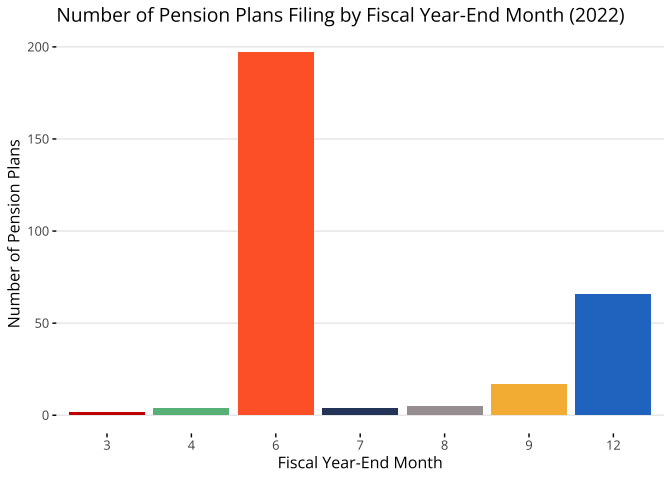
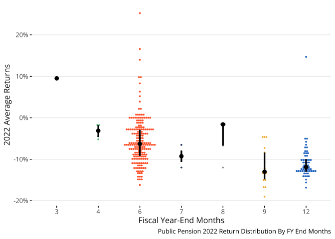
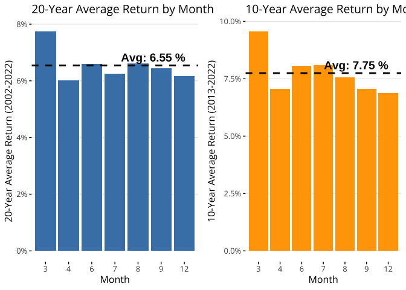
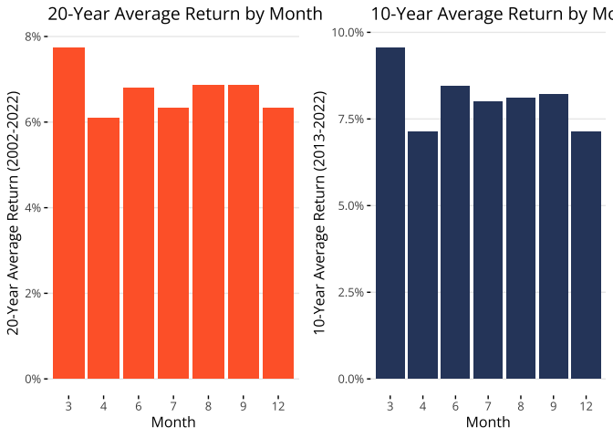

``` r
font_add_google("Open Sans")
showtext_auto()

# Define theme_reason based on the uploaded file
theme_reason <- function(base_line_size = 0.5,
                         base_family = "Open Sans",
                         base_size = 12) {
  theme_minimal(base_family = base_family,
                base_size = base_size,
                base_line_size = base_line_size) %+replace%
    theme(
      axis.ticks = element_line(),
      panel.grid = element_blank(),
      panel.grid.major.y = element_line(color = "grey92"),
      legend.position = "top"
    )
}

C1 <- "#CC0100"  # Light orange 
C2 <- "#66BB8B"  # Mid-tone orange
C3 <- "#FF6733"  # Warm orange
C4 <- "#2F456B"  # Lighter orange
C5 <- "#A69FA1"  # Pale orange
C6 <- "#F6B941"  # Yellow-orange
C7 <- "#2779CB"  # Bright orange

reason_colors <- c(C1, C2, C3, C4, C5, C6, C7)
```


``` r
combined_data_clean <- read.csv("combined_data_clean.csv")
```


# 1 The Disparity in Fiscal Years 

# 1.1 Figure 1: Number of Plans filing in each fiscal year end month


``` r
data_2022 <- combined_data_clean %>%
  filter(fye >= as.Date("2022-01-01") & fye <= as.Date("2022-12-31"))

# Calculate the number of plans that file in each fiscal year-end month for 2022
plan_counts_2022 <- data_2022 %>%
  group_by(month) %>%
  summarise(plan_count = n_distinct(plan))  # Count distinct pension plans per month

# Create a bar chart displaying the number of plans per fiscal year-end month
Bars <- ggplot(plan_counts_2022, aes(x = as.factor(month), y = plan_count, fill = as.factor(month))) +
  geom_bar(stat = "identity", show.legend = FALSE) +  # Bar chart
  scale_fill_manual(values = reason_colors) +  # Assign the colors to each month
  labs(x = "Fiscal Year-End Month", y = "Number of Pension Plans", 
       title = "Number of Pension Plans Filing by Fiscal Year-End Month (2022)") +
  theme_reason()  # Clean theme for the chart

Bars
```

<!-- -->

``` r
ggsave("outputs/Bars.png", plot = Bars, width = 16, height = 7)
```


``` r
plan_counts_2022 <- data_2022 %>%
  group_by(month) %>%
  summarise(plan_count = n_distinct(plan))  # Count distinct pension plans per month

# Calculate total number of plans in 2022
total_plans_2022 <- sum(plan_counts_2022$plan_count)

# Calculate the percentage of plans filing in each month
plan_counts_2022 <- plan_counts_2022 %>%
  mutate(percentage = (plan_count / total_plans_2022) * 100)

# Display the table with fiscal year-end month and percentage of total plans
plan_counts_2022 %>% 
  arrange(month) %>% 
  knitr::kable(col.names = c("Fiscal Year-End Month", "Number of Plans", "Percentage of Total Plans"))
```


| Fiscal Year-End Month| Number of Plans| Percentage of Total Plans|
|---------------------:|---------------:|-------------------------:|
|                     3|               2|                 0.6779661|
|                     4|               4|                 1.3559322|
|                     6|             197|                66.7796610|
|                     7|               4|                 1.3559322|
|                     8|               5|                 1.6949153|
|                     9|              17|                 5.7627119|
|                    12|              66|                22.3728814|


# 2. 2022 Returns by Fiscal Year End Month Cohort 

# 2.2. 2022: Average Returns by Month End

``` r
data_2022_2 <- combined_data_clean %>%
  filter(fye >= as.Date("2022-01-01") & fye <= as.Date("2022-12-31"))

# Calculate the mean return for each fiscal year-end month
mean_returns_by_month <- data_2022_2 %>%
  group_by(month) %>%
  summarise(mean_return = mean(return, na.rm = TRUE)) %>%  # Calculate the mean return for each month
  mutate(mean_return = round(mean_return * 100, 2))  # Convert to percentage and round to 2 decimal places

# Display the average returns table for fiscal year 2022
mean_returns_by_month %>%
  knitr::kable(col.names = c("Fiscal Year-End Month", "Mean Return (%)"),
               caption = "Mean Returns by Fiscal Year-End Month for 2022",
               format = "latex")  # or omit `format` to be compatible with both
```

\begin{table}

\caption{\label{tab:unnamed-chunk-6}Mean Returns by Fiscal Year-End Month for 2022}
\centering
\begin{tabular}[t]{r|r}
\hline
Fiscal Year-End Month & Mean Return (\%)\\
\hline
3 & 9.51\\
\hline
4 & -3.29\\
\hline
6 & -5.56\\
\hline
7 & -9.26\\
\hline
8 & -4.69\\
\hline
9 & -11.79\\
\hline
12 & -10.84\\
\hline
\end{tabular}
\end{table}

``` r
# Print the mean returns by month
print(mean_returns_by_month)
```

```
## # A tibble: 7 × 2
##   month mean_return
##   <int>       <dbl>
## 1     3        9.51
## 2     4       -3.29
## 3     6       -5.56
## 4     7       -9.26
## 5     8       -4.69
## 6     9      -11.8 
## 7    12      -10.8
```

# 2.3. Average 2022 Return For all Plans


``` r
overall_avg_return_2022 <- data_2022 %>%
  summarise(arithmetic_avg_return = mean(return, na.rm = TRUE)) %>%
  mutate(arithmetic_avg_return = round(arithmetic_avg_return * 100, 2))

# Print the overall average return for the fiscal year 2022
print(paste("Overall Average Return for FY 2022:", overall_avg_return_2022$arithmetic_avg_return, "%"))
```

```
## [1] "Overall Average Return for FY 2022: -6.89 %"
```


# 2.4. Figure 2: Distribution of 2022 Returns by Fiscal Year End Month Cohort


``` r
data_2022 <- combined_data_clean %>%
  filter(fye >= as.Date("2022-01-01") & fye <= as.Date("2022-12-31"))

return_plan_22 <- data_2022 %>%
  group_by(plan) %>%
  summarise(avg_return = mean(return, na.rm = TRUE),  # Calculate arithmetic mean for each plan
            month = mean(month, na.rm = TRUE))  # Get the mean fiscal year-end month for each plan

D22 <- ggplot(return_plan_22, aes(x = as.factor(round(month)), y = avg_return, fill = as.factor(round(month)))) +
  stat_dotsinterval(slab_linewidth = 0, 
                    side = "both", 
                    binwidth = NA,  # Automatically determine binwidth
                    overflow = "compress",  # Compress spacing to fit within bounds
                    .width = c(0.50),
                    show.legend = FALSE) +
  scale_y_continuous(labels = scales::percent_format()) +
  scale_fill_manual(values = reason_colors) +
  labs(x = "Fiscal Year-End Months", y = "2022 Average Returns",
       caption = "Public Pension 2022 Return Distribution By FY End Months") +
  theme_reason()

D22
```

```
## Warning: Removed 13 rows containing missing values or values outside the scale range
## (`stat_slabinterval()`).
```

<!-- -->

``` r
ggsave("outputs/D22.png", plot = D22, width = 16, height = 7)
```

```
## Warning: Removed 13 rows containing missing values or values outside the scale range
## (`stat_slabinterval()`).
```
# 3. Long Run Returns by Fiscal Year End Monrh Cohort 

# 3.1 Average 10 and 20 year Returns For All plans  


``` r
return_national_fye <- combined_data_clean %>%
  filter(!is.na(mva)) %>%
  group_by(month, fye) %>%
  summarise(
    national_return = mean(return, na.rm = TRUE),  # Changed to simple mean for unweighted average
    national_ARR = mean(arr, na.rm = TRUE),  # Changed to simple mean for unweighted average
    .groups = "drop"  # Override the default grouping behavior
  ) %>%
  ungroup()

# Convert 'fye' to Date format
return_national_fye <- return_national_fye %>%
  mutate(fye = as.Date(fye))

return_10yr_filtered <- return_national_fye %>%
  filter(fye >= as.Date("2013-01-01") & fye <= as.Date("2022-12-31"))

return_20yr_filtered <- return_national_fye %>%
  filter(fye >= as.Date("2002-01-01") & fye <= as.Date("2022-12-31"))

# Calculate geometric means by fiscal year-end month
overall_geo_avg_10yr <- return_10yr_filtered %>%
  group_by(month) %>%
  summarise(geo_avg_10yr = prod(1 + national_return)^(1 / n()) - 1, .groups = "drop")

overall_geo_avg_20yr <- return_20yr_filtered %>%
  group_by(month) %>%
  summarise(geo_avg_20yr = prod(1 + national_return)^(1 / n()) - 1, .groups = "drop")

# Calculate overall geometric averages across all months
overall_geo_avg_10yr_all <- prod(1 + overall_geo_avg_10yr$geo_avg_10yr)^(1 / nrow(overall_geo_avg_10yr)) - 1
overall_geo_avg_20yr_all <- prod(1 + overall_geo_avg_20yr$geo_avg_20yr)^(1 / nrow(overall_geo_avg_20yr)) - 1

# Print the overall geometric averages
print(paste("Overall 10-Year Geometric Average Return (2013-2022):", round(overall_geo_avg_10yr_all * 100, 2), "%"))
```

```
## [1] "Overall 10-Year Geometric Average Return (2013-2022): 7.75 %"
```

``` r
print(paste("Overall 20-Year Geometric Average Return (2002-2022):", round(overall_geo_avg_20yr_all * 100, 2), "%"))
```

```
## [1] "Overall 20-Year Geometric Average Return (2002-2022): 6.55 %"
```


# 3.2 Figure 3: 10 & 20-Year Average Public Pension Returns By Fiscal Year End Month


``` r
plot_20yr <- ggplot(overall_geo_avg_20yr, aes(x = as.factor(month), y = geo_avg_20yr)) +
  geom_bar(stat = "identity", fill = "steelblue") +
  geom_hline(yintercept = overall_geo_avg_20yr_all, color = "black", linetype = "dashed", size = 1) +  # Add overall geometric average line
  annotate("text", x = Inf, y = overall_geo_avg_20yr_all, label = paste("Avg:", round(overall_geo_avg_20yr_all * 100, 2), "%"), 
           vjust = -0.5, hjust = 1.2, size = 5, color = "black", fontface = "bold") +  # Add text for overall geometric average
  scale_y_continuous(labels = scales::percent_format()) +
  labs(x = "Month", y = "20-Year Average Return (2002-2022)", title = "20-Year Average Return by Month") +
  theme_reason()
```

```
## Warning: Using `size` aesthetic for lines was deprecated in ggplot2 3.4.0.
## ℹ Please use `linewidth` instead.
## This warning is displayed once every 8 hours.
## Call `lifecycle::last_lifecycle_warnings()` to see where this warning was
## generated.
```

``` r
# Plot for 10-year average returns by month with overall geometric average line and label
plot_10yr <- ggplot(overall_geo_avg_10yr, aes(x = as.factor(month), y = geo_avg_10yr)) +
  geom_bar(stat = "identity", fill = "orange") +
  geom_hline(yintercept = overall_geo_avg_10yr_all, color = "black", linetype = "dashed", size = 1) +  # Add overall geometric average line
  annotate("text", x = Inf, y = overall_geo_avg_10yr_all, label = paste("Avg:", round(overall_geo_avg_10yr_all * 100, 2), "%"), 
           vjust = -0.5, hjust = 1.2, size = 5, color = "black", fontface = "bold") +  # Add text for overall geometric average
  scale_y_continuous(labels = scales::percent_format()) +
  scale_fill_manual(values = reason_colors) + 
  labs(x = "Month", y = "10-Year Average Return (2013-2022)", title = "10-Year Average Return by Month") +
  theme_reason()

# Arrange the plots in a grid
grid.arrange(plot_20yr, plot_10yr, ncol = 2)
```

<!-- -->


``` r
plot_20yr2 <- ggplot(overall_geo_avg_20yr, aes(x = as.factor(month), y = geo_avg_20yr)) +
  geom_bar(stat = "identity", fill = "#FF6733") +
  scale_y_continuous(labels = scales::percent_format()) +
  labs(x = "Month", y = "20-Year Average Return (2002-2022)", title = "20-Year Average Return by Month") +
  theme_reason() 

# Plot for 10-year average returns by month with overall geometric average line and label
plot_10yr2 <- ggplot(overall_geo_avg_10yr, aes(x = as.factor(month), y = geo_avg_10yr)) +
  geom_bar(stat = "identity", fill = "#2F456B") +
  scale_y_continuous(labels = scales::percent_format()) +
  scale_fill_manual(values = reason_colors) + 
  labs(x = "Month", y = "10-Year Average Return (2013-2022)", title = "10-Year Average Return by Month") +
  theme_reason() 


# Arrange the plots in a grid
G3 <- grid.arrange(plot_20yr2, plot_10yr2, ncol = 2)
```

<!-- -->

# 3.3 Average 10 and 20 year Returns by Fiscal Year End Month Cohort   


``` r
average_returns_summary <- overall_geo_avg_10yr %>%  # Changed to geometric averages
  rename("10-Year Avg Return" = geo_avg_10yr) %>%
  left_join(overall_geo_avg_20yr %>% rename("20-Year Avg Return" = geo_avg_20yr), by = "month") %>%
  mutate(
    `10-Year Avg Return` = round(`10-Year Avg Return` * 100, 2),
    `20-Year Avg Return` = round(`20-Year Avg Return` * 100, 2)
  )

# Display the combined table with fiscal year-end month, 10-year and 20-year average returns
average_returns_summary %>%
  arrange(month) %>%
  knitr::kable(col.names = c("Fiscal Year-End Month", "10-Year Average Return (%)", "20-Year Average Return (%)"),
               format = "html",
               caption = "Average Returns per Fiscal Year-End Month (10-Year and 20-Year Basis)") %>%
  kableExtra::kable_styling("striped", full_width = F)  # Optional styling for better visualization
```

<table class="table table-striped" style="width: auto !important; margin-left: auto; margin-right: auto;">
<caption>Average Returns per Fiscal Year-End Month (10-Year and 20-Year Basis)</caption>
 <thead>
  <tr>
   <th style="text-align:right;"> Fiscal Year-End Month </th>
   <th style="text-align:right;"> 10-Year Average Return (%) </th>
   <th style="text-align:right;"> 20-Year Average Return (%) </th>
  </tr>
 </thead>
<tbody>
  <tr>
   <td style="text-align:right;"> 3 </td>
   <td style="text-align:right;"> 9.55 </td>
   <td style="text-align:right;"> 7.74 </td>
  </tr>
  <tr>
   <td style="text-align:right;"> 4 </td>
   <td style="text-align:right;"> 7.07 </td>
   <td style="text-align:right;"> 6.01 </td>
  </tr>
  <tr>
   <td style="text-align:right;"> 6 </td>
   <td style="text-align:right;"> 8.05 </td>
   <td style="text-align:right;"> 6.60 </td>
  </tr>
  <tr>
   <td style="text-align:right;"> 7 </td>
   <td style="text-align:right;"> 8.10 </td>
   <td style="text-align:right;"> 6.25 </td>
  </tr>
  <tr>
   <td style="text-align:right;"> 8 </td>
   <td style="text-align:right;"> 7.55 </td>
   <td style="text-align:right;"> 6.61 </td>
  </tr>
  <tr>
   <td style="text-align:right;"> 9 </td>
   <td style="text-align:right;"> 7.06 </td>
   <td style="text-align:right;"> 6.45 </td>
  </tr>
  <tr>
   <td style="text-align:right;"> 12 </td>
   <td style="text-align:right;"> 6.87 </td>
   <td style="text-align:right;"> 6.18 </td>
  </tr>
</tbody>
</table>


